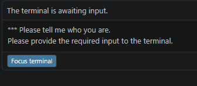

# CSKA Explorer SPA

Single Page App за преглед на информация за футболен клуб (примерно ЦСКА) чрез публичния TheSportsDB API (без token).

## About

CSKA Explorer е леко, фронтенд-only SPA приложение за визуализиране на футболни данни в реално време.
Проектът е фокусиран върху бърз достъп до клубна информация, текущ състав и последни мачове, без нужда от API ключ.

## Live Site

След като GitHub Pages deploy-ът мине успешно, сайтът е достъпен на:

https://svetoslavgochev.github.io/cska-explorer/

## Какво включва

- Зареждане на клубни данни: име, основан, стадион, адрес, държава, сайт
- Зареждане на текущ състав
- Поле за име на отбор
- UI на български + адаптивен дизайн
- 5-часов локален кеш на данните + резервен fallback профил от fccska mirror при проблем с API

## Стартиране

1. Отвори [index.html](index.html) в браузър.
2. Въведи име на отбор (по подразбиране `CSKA Sofia`).
3. Натисни "Зареди данни".

## Файлове

- [index.html](index.html)
- [styles.css](styles.css)
- [app.js](app.js)
- [cskaData.js](cskaData.js)

## Screenshot

### Основен изглед

## Бърз тест без API ключ

1. Отвори `cskaData.js`.
2. По желание смени `TEAM_NAME`.
3. Стартирай:
	- в Node 18+: `node cskaData.js`
	- или в браузър конзолата (копирай кода и изпълни)

Скриптът прави:

- `GET /searchteams.php?t={teamName}`
- `GET /lookup_all_players.php?id={teamId}`
- `GET /eventslast.php?id={teamId}`

## Бележки

- Ако няма резултат, провери правописа на името на отбора.
- Ако браузърът блокира заявките (CORS), пусни страницата през локален сървър вместо директно от file://.
