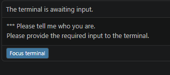

# CSKA Explorer

CSKA Explorer е фенски сайт за ЦСКА и Efbet Лига с локален Node server, live API endpoint и статичен build за GitHub Pages.

## Live Site

След успешен GitHub Pages deploy сайтът е достъпен на:

https://svetoslavgochev.github.io/cska-explorer/

## Какво включва

- Класиране в Efbet Лига и информация за състава на ЦСКА
- Локален API endpoint на `/api/data` с кеш и fallback snapshot
- UI на български и английски с адаптивен layout
- Root entry point, използван еднакво локално и в production
- Отделен static build за GitHub Pages в `dist-static/`

## Стартиране локално

Изисквания:

- Node.js 18+

Стъпки:

1. Инсталирай зависимостите с `npm install`.
2. Стартирай локалния server с `npm start`.
3. Отвори `http://localhost:3000`.

Локалният server обслужва canonical root файловете и API endpoint-ите. Не стартирай сайта чрез директно отваряне на `index.html` от `file://`, защото така няма да работят API заявките и fallback логиката.

## Основна структура

- [index.html](index.html) — canonical entry point на сайта
- [app.js](app.js) — основна клиентска логика и rendering
- [styles.css](styles.css) — основни стилове
- [runtime-config.js](runtime-config.js) — runtime конфигурация за frontend-а
- [server.js](server.js) — локален HTTP server и `/api/*` endpoints
- [data/bootstrap-data.json](data/bootstrap-data.json) — fallback snapshot за frontend и backend
- [public/test-api.html](public/test-api.html) — помощна страница за бърза проверка на `/api/data`
- [dist-static](dist-static) — генериран static build за GitHub Pages

## Static Build

Статичният build се генерира от canonical root файловете, а не от отделен template в `public/`.

Команда:

- `node generate-static.js`

Резултат:

- build файловете се записват в `dist-static/`
- GitHub Pages workflow публикува точно `dist-static/`

## Deploy

### Vercel

- Vercel използва root [index.html](index.html) като production entry point
- API функциите се обслужват от [api](api), а fallback route-ът е към root сайта
- Подходящо е, когато искаш live frontend + serverless API в една deployment среда

### GitHub Pages

- GitHub Pages публикува генерирания static build от `dist-static/`
- Build-ът се създава с `node generate-static.js`
- Подходящо е, когато искаш чисто статична версия без локалния Node server

## Ops Helpers

Бързи команди за поддръжка и проверка:

- `npm run ops:refresh` — обновява статистиките на играчите в `data/bootstrap-data.json` от Sportal + Flashscore и добавя ред в `data/refresh-log.ndjson`
- `npm run ops:verify:local` — проверява локалните `api/health` и `api/data` метрики
- `npm run ops:verify:live` — проверява live данните от GitHub Pages (`updatedAt`, играчи, флагове, мачове)
- `npm run ops:refresh-and-push` — изпълнява refresh + live verify + commit + push на `data/bootstrap-data.json` и `data/refresh-log.ndjson`

Лог файл:

- `data/refresh-log.ndjson` съдържа по един JSON ред за всяко обновяване: timestamp, брой играчи, флагове, мачове и source

## Backend Auto-Refresh

- Backend refresh цикълът е автоматичен и по подразбиране е `3360` минути, тоест 3 пъти седмично
- Сървърният cache TTL също е настроен по подразбиране на около 56 часа, за да следва същия по-рядък режим на обновяване при нормални посещения
- Може да се промени с env променливата `AUTO_REFRESH_MINUTES`
- При временен проблем с външен източник се пази и подава fallback snapshot от `data/bootstrap-data.json`
- API endpoint: `/api/data` и `/api/data?refresh=1` за принудително обновяване

## Screenshot

